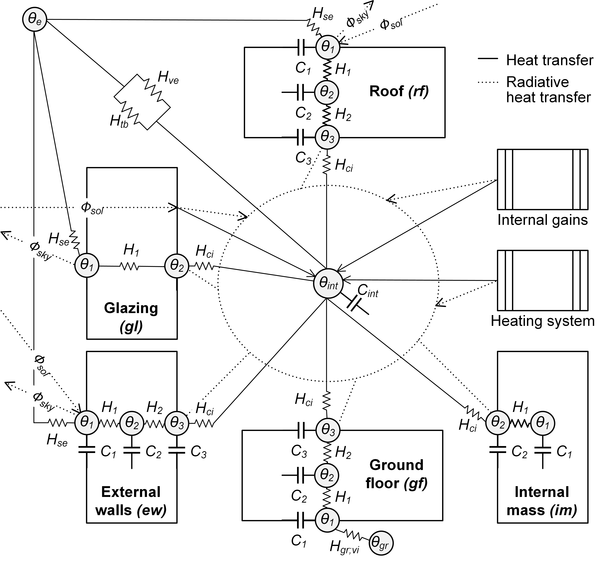
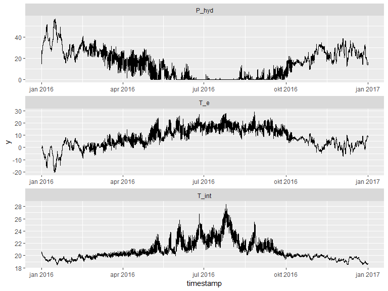
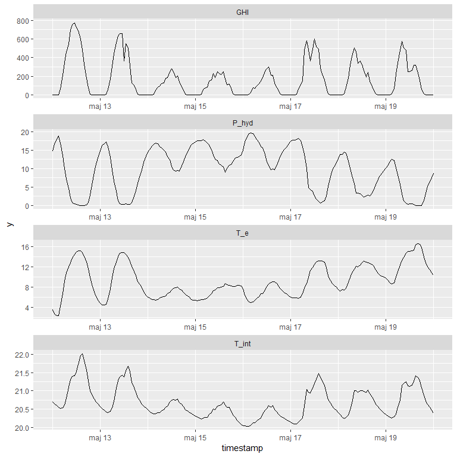

Simulating space heating use - using the the ISO14N modelling framework
================
Lukas Lundström
2019-03-02

# Introduction

This respiratory holds code for calculating space heating use according
to the ISO14N modelling framework presented in the paper
[\[1\]](https://doi.org/10.3390/en12030485 "Lundström, Lukas, Jan Akander, and Jesús Zambrano. 2019. Development of a Space Heating Model Suitable for the Automated Model Generation of Existing Multifamily Buildings — A Case Study in Nordic Climate. Energies 12 (3).").
Includes code to construct the thermal network, running the simulation,
modelling a hydronic radiator heating system, satellite-based solar
irradiance, shading, window blinds, wind- and stack-driven air leakage,
and variable exterior surface heat transfer coefficients. The thermal
network is a 14 node lumped and simplified version of the ISO
52016-1:2017 standard
[\[2\]](https://www.iso.org/standard/65696.html "Energy Performance of Buildings - Energy Needs for Heating and Cooling, Internal Temperatures and Sensible and Latent Heat Loads - Part 1 Calculation Procedures (ISO 52016-1:2017)."),
as illustrated in the figure bellow. Also 20 node version is included,
where opaque building elements are splitted into 5
planes.



Following libraries need to be installed and loaded:

``` r
library(tidyverse)
library(devtools)
library(lubridate)
library(Rcpp)
library(RcppRoll)
library(rstan)
```

The procedures to calculate solar irradiance on a surface with arbitrary
orientation and tilt, according to ISO 52010-1:2017 standard, are
published in a separate repository:
<https://github.com/lukas-rokka/solarCalcISO52010>. Use following code
to install it.

``` r
devtools::install_github("lukas-rokka/solarCalcISO52010")
#> Skipping install of 'solarCalcISO52010' from a github remote, the SHA1 (defff689) has not changed since last install.
#>   Use `force = TRUE` to force installation
```

Now, load the `solarCalcISO52010` and source needed R and C++ functions:

``` r
library(solarCalcISO52010)
source("R/test_building.R")
source("R/pre_processing.R")
source("R/helpers.R")
Rcpp::sourceCpp("src/calc_Trad_s.cpp")
```

The “test\_building.R” holds a data frame with parameters describing the
test building used in the paper
[\[1\]](https://doi.org/10.3390/en12030485 "Lundström, Lukas, Jan Akander, and Jesús Zambrano. 2019. Development of a Space Heating Model Suitable for the Automated Model Generation of Existing Multifamily Buildings — A Case Study in Nordic Climate. Energies 12 (3)."),
“pre\_processing.R” holds the pre-processing procedures and “helpers.R”
holds some additional functions.

# Climate data

The
[ERA5](https://cds.climate.copernicus.eu/cdsapp#!/dataset/reanalysis-era5-single-levels)
reanalysis climate dataset is used for meteorological data and the
[CAMS](http://www.soda-pro.com/web-services/radiation/cams-radiation-service)
radiation service is used for satellite-based solar irradiance data.
Procedures for acquiring the climate data are not presented here
(e.g. my package [camsRad](https://github.com/ropensci/camsRad) can be
used to access CAMS data from R). Here we load a ready made climate file
for Norrköping, Sweden:

``` r
df_clim <-
  read_rds("inst/extdata/df_clim.rds") %>%
  filter(between(timestamp, ymd_h(2016010100), ymd_h(2016123123))) %>%
  change_interval("hour")
df_clim 
#> # A tibble: 8,784 x 14
#>    timestamp             G_dir G_dif   GHI I_str I_strd albedo     T_e
#>    <dttm>                <dbl> <dbl> <dbl> <dbl>  <dbl>  <dbl>   <dbl>
#>  1 2016-01-01 00:00:00 0.       0     0    -64.9   242.  0.240 -0.835 
#>  2 2016-01-01 01:00:00 0.       0     0    -62.0   245.  0.239 -0.626 
#>  3 2016-01-01 02:00:00 0.       0     0    -51.7   256.  0.239 -0.335 
#>  4 2016-01-01 03:00:00 0.       0     0    -43.6   266.  0.239 -0.0937
#>  5 2016-01-01 04:00:00 0.       0     0    -34.5   276.  0.239  0.170 
#>  6 2016-01-01 05:00:00 0.       0     0    -30.6   281.  0.239  0.396 
#>  7 2016-01-01 06:00:00 0.       0     0    -31.9   280.  0.239  0.572 
#>  8 2016-01-01 07:00:00 0.       0     0    -43.7   268.  0.239  0.669 
#>  9 2016-01-01 08:00:00 4.63e+0  2.21  2.36 -37.9   275.  0.239  0.816 
#> 10 2016-01-01 09:00:00 5.33e-4  9.53  9.53 -34.6   280.  0.239  1.000 
#> # ... with 8,774 more rows, and 6 more variables: T_dp <dbl>, T_gr <dbl>,
#> #   U10 <dbl>, tcc <dbl>, u10 <dbl>, v10 <dbl>
```

# Pre-processing

Now, with the climate data loaded we can start running the
pre-processing procedures. The `solarCalcISO52010` package is used to
calculate solar irradiance on horizontal and vertical surfaces, typical
sub-urban shading factors are estimated as well typical reduction from
window blinds usage.

``` r
df_clim <- df_clim %>%
  solarCalcISO52010::tidyISO52010(p$lat, p$lng, 0, NULL, surfaceAzimuths = 0, surfaceTilts= 0) %>%
  as_tibble() %>% rename(I_dif_hor = I_tot_dif_s1, I_dir_hor = I_tot_dir_s1) %>%
  calc_F_sh(p) %>%                                  # estimate typical shading, Section 3.4 in [1]
  #mutate(F_sh_ver=1, F_sh_hor=1) %>%               # assume no shading
  mutate(I_tot_hor_sh=I_dif_hor + I_dir_hor*F_sh_hor)%>% # calc irradiance hor surface including shading effects, eq 30 in [1]
  calc_I_ver_sh(p) %>%                              # calc irradiance vertical surface including shading, eq 28 & 29 in [1]
  calc_blinds(p) #%>%                               # estimate effect from blinds, Section 3.5 in [1] 
  #mutate(g_bl=0.53)                                # assume blinds allways drawn
```

Heat transfer coefficients for weather exposed exterior surfaces depends
on the local wind speeds. Wind speeds are discretized into 10 categories
and separate heat transfer coefficients are calculated for each category
(which allows inverting 10 system A matrices before the simulation is
started, instead of inverting the A matrix at each timestep). Further
the supply temperatures are calculated based on the given look-up table,
internal heat gains are given as a constant of 3 W/m2, solar heat gains
are calculated, infiltration is estimated and ventilation flow rate is
given as a constant of 0,35 l/(s\*m2).

``` r
df <- df_clim %>%
  mutate(
    U10_idx = ceiling(p$U10_idx_N*((U10)/(max(U10)))),  # wind speed indices
    T_hyd_s = calc_Trad_s(T_e, p$xy[[1]]),     # supply temp radiators, intepolation from look-up table 
    P_gn_int= 3,                               # internal heat gains
    P_gn_sol= g_bl*p$g_gl*p$r_si[[1]][3]*I_tot_ver_sh, # solar heat gains, eq 27 in [1]
    #Ev_sol  = p$Kv_sol*P_gn_sol,              # Illuminance natural light
    T_sky = (I_strd/5.67e-8)^0.25 - 273.15     # Sky temperature, eq 37 in [1]
    ) %>%
  calc_U_loc(p) %>%     # local wind speed
  calc_Hmod_inf(p) %>%  # infiltration 
  calc_H_ve(p)          # ventilation 

mat_h_se <- df %>%
  group_by(U10_idx) %>% summarise(U10=mean(U10)) %>%  # mean wind speed at each U10_idx
  calc_U_loc(p) %>%               # local wind speed
  calc_h_se(p, dT=5) %>%          # heat transfer coefs
  select(h_se_rf:h_se_gl) %>%     # select column nr 1: roof, nr 2: external walls, nr 3: glazing 
  as.matrix()
```

# Running the simulation

The actual RC-network construction and simulation procedures are written
in Stan, found in the ‘src/stan\_files/chunks/ISO52016.stan’ file. Here
it’s parsed into C++, compiled and exposed as a R-callable function
called `ISO14N()`:

``` r
mod1 <- stanc(model_code=paste0(
  "functions {\n",
  read_file("src/stan_files/chunks/ISO14N.stan"), 
  "}\ndata{} \nparameters{}\nmodel{}"))
expose_stan_functions(mod1)
```

Some of the constants and parameters are given in the `p` data frame,
that was loaded when the file ‘R/test\_building.R’ was sourced, all
boundary condition variables are in the `df` data frame. Note that the
interface is in an early development stage and is likely to change in
the future. Now, we run the simulation:

``` r

N_pl <- 3;     # No. of planes for opaque elements.  3 for 14 node system, 5 for 20 node system
m = N_pl*3+5;  # Total number nodes/states

res <- ISO14N(
  r_el = c(1., 0.63, 0.15, 1.5, 1.),
  cl_el= c(1, 4, 1, 1, 1),
  U_el = c(0.2, 0.72, 2.9, 1.0, 0.23),
  U_gr_vi = 0.92,          
  H_tb = 0,         
  dt = diff(as.numeric(df$timestamp[1:2]))/3600, 
  k_m = c(2300*880*0.1, 500*1050*0.1, 3600, 500*1050*0.075, 2300*880*0.1)/3600,
  C_int = p$C_int,
  k_gr= 280,
  H_hyd = 0.75, n_hyd = 1.28, T_trv_pb = 2, 
  T_int_set = 21, 
  a_hyd = p$a_hyd, b_hyd = p$b_hyd, 
  T_hyd_s = df$T_hyd_s,
  f_c_hyd = 0.5, f_c_int = 0.4, f_c_sol= 0.1,
  Fsky_ver = 0.5, Fsky_hor = 1.0,
  U10_idx = df$U10_idx, h_se = mat_h_se,
  T_e = df$T_e, T_gr = df$T_gr, T_sky = df$T_sky,
  I_tot_ver_sh = df$I_tot_ver_sh, I_tot_hor_sh = df$I_tot_hor_sh, 
  P_gn_sol = df$P_gn_sol, 
  P_gn_int = df$P_gn_int, 
  H_ve = df$H_ve,
  H_inf = df$Hmod_inf*p$C_inf,
  N_pl =  N_pl,           
  debug = 0,              
  Nout = 3, 
  recalc_h_re = 1    
)

df2 <- df %>% mutate(T_int = res[, m], P_hyd= res[, m+1],  u_trv = res[, m+2],  T_mrt = res[, m+3], T_op = res[, m+4]) 
```

And a simple plot of the results, showing the full-year result for the
space heating (P\_hyd), external air temperature (T\_e) and indoor
temperature (T\_int):

``` r
df2 %>% 
  select(timestamp, T_e, T_int, P_hyd) %>% 
  filter(between(timestamp, ymd_h("2016-01-01 00", tz="UTC"), ymd_h("2016-12-31 23", tz="UTC"))) %>%
  gather(var, y, -timestamp) %>% 
  ggplot(aes(timestamp, y)) +
  facet_wrap(~var, ncol=1, scales = "free") + 
  geom_line()
```



Here’s a plot from a short spring sample period, this time including
global horizontal irradiance (GHI). The impact of solar heat gains and
the buildings thermal mass can be spotted as an increased heating usage
during the cloudy period of 14th may to 17th may.

``` r
df2 %>% 
  select(timestamp, T_e, T_int, P_hyd, GHI) %>% 
  filter(between(timestamp, ymd_h("2016-05-12 00", tz="UTC"), ymd_h("2016-05-20 00", tz="UTC"))) %>%
  gather(var, y, -timestamp) %>% 
  ggplot(aes(timestamp, y)) +
  facet_wrap(~var, ncol=1, scales = "free") + 
  geom_line()
```



# References

1.  Lundström, Lukas, Jan Akander, and Jesús Zambrano. 2019.
    “Development of a Space Heating Model Suitable for the Automated
    Model Generation of Existing Multifamily Buildings — A Case Study in
    Nordic Climate”. Energies 12 (3).
    <https://doi.org/10.3390/en12030485>

2.  ISO 52016-1:2017. “Energy Performance of Buildings - Energy Needs
    for Heating and Cooling, Internal Temperatures and Sensible and
    Latent Heat Loads - Part 1 Calculation Procedures.”
    <https://www.iso.org/standard/65696.html>
